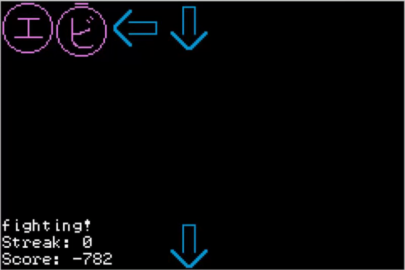

踊り踊り革命 is a rhythm game inspired by the musical masterpiece 4'33" by John Cage.

The game starts with a bouncing どりどり革命 logo (tbh it should probably be おどりおどり革命). Press any button (besides L, R, or Select) to continue. Once gameplay begins, press appropriate buttons in time to the beat (that is, when the corresponding icons reach the top of the screen). エ represents the A button, and ビ represents the B button. After about a minute and a half, the game will end and based in your score, you will be presented with your spirit Pokémon, which can be Mewtwo, Rotom, Porygon-Z, or Bidoof. Press any button besides L or R to return to the start screen. Press Select at any time to restart the game.




(can't press buttons while recording with Gyazo, so I'm just letting those arrows fly and losing points)

# Build in Ubuntu

When developing this, I tested this on a Docker image specific to our class. Here's a set of alternate instructions that should work.

```bash
sudo add-apt-repository ppa:sergio-br2/vbam-trunk
sudo apt update
sudo apt install vbam-sdl vbam
```

If you're using Windows Subsystem for Linux, install and launch [Xming](https://sourceforge.net/projects/xming/), and then in the terminal, run
```bash
export DISPLAY=:0
```

Then, `cd` to this directory, and run `make vba` or `vbam Game.gba`. You could also try `visualboyadvance-m Game.gba`, but none of the controls seem to work in that emulator.

If the above doesn't work, these commands could help, but I don't think they should be necessary:
```bash
sudo add-apt-repository ppa:tricksterguy87/ppa-gt-cs2110
sudo apt update
sudo apt install gcc-arm-none-eabi cs2110-vbam-sdl mednafen cs2110-gba-linker-script nin10kit
```

Also, framerate is about five or ten times too high. Consider this to be Ultra Nightmare Lunatic+ mode.